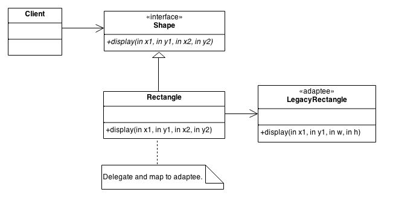
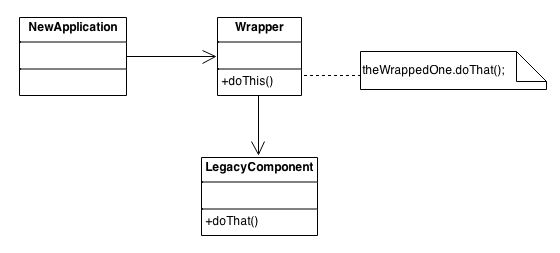

# Adapter
An Adapter pattern acts as a connector between two incompatible interfaces that otherwise cannot be connected directly. An Adapter wraps an existing class with a new interface so that it becomes compatible with the client’s interface.

The main motive behind using this pattern is to convert an existing interface into another interface that the client expects. It's usually implemented once the application is designed.

The adapter does not add functionality. The decorator is designed for adding functionality.

The Adapter could also be thought of as a "wrapper".

## Usage
The problem we are solving here is that of non-compatible interfaces.