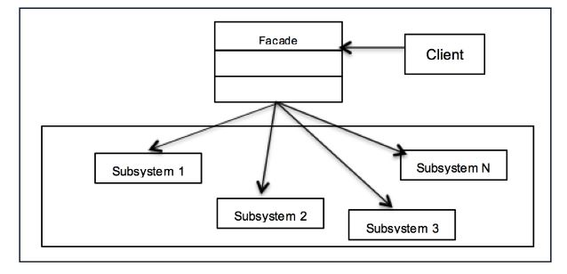

# Facade
Facade is more like a simple gateway to a complicated set of functionality. You make a black-box for your clients to worry less i.e. make interfaces simpler.

## Usage
Make (complex) existing interfaces simpler.