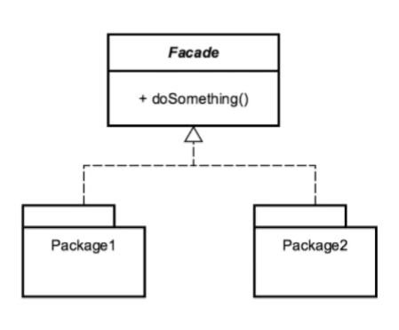

# Facade
Facade is more like a simple gateway to a complicated set of functionality. You make a black-box for your clients to worry less i.e. simplify the interface or client usage.
It also makes an API easier to use.

## Design considerations
- It's a class that itilizes composition.
- You shouldn't have a need for inheritance.

The facade contains other classes.

## Usage
Make (complex) existing interfaces simpler.