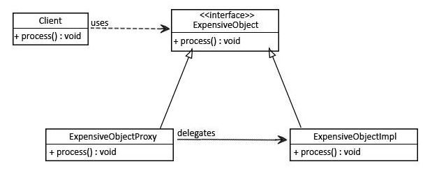

# Proxy
Proxy is a structural design pattern that provides an object that acts as a substitute for a real service object used by a client. A proxy receives client requests, does some work (access control, caching, etc.) and then passes the request to a service object.

## Usage
When to use a Proxy pattern:
- When the original object is in a different space (maintaining connections, encode/decode)
- Security to provide controlled access based on access right (Protection Proxy) 
- Caching